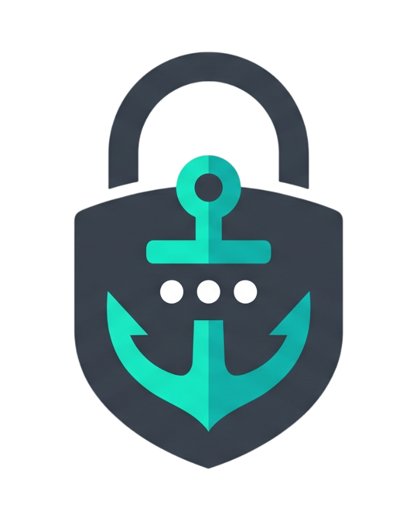

# 🛡️ HermitVault - Offline Password Manager



**HermitVault** es un gestor de contraseñas local, offline y de alta seguridad diseñado para usuarios que priorizan la privacidad absoluta. No hay nubes, no hay servidores externos; tus datos nunca salen de tu máquina.

## ✨ Características Principales

- **Seguridad "Zero Knowledge":** Tu contraseña maestra nunca se guarda. Se utiliza exclusivamente para derivar la clave de cifrado en memoria.
- **Soporte Multi-Bóveda:** Crea y gestiona múltiples archivos de bóveda independientes para diferentes usuarios o propósitos.
- **Política de Seguridad Obligatoria:** La contraseña del Vault debe ser al menos de nivel **"Good"** para inicializar la bóveda.
- **Interfaz Premium Modernizada:** Diseño ultra-moderno con botones redondeados, barra lateral de navegación y estética "Deep Charcoal".
- **🧙 Generador de Contraseñas:** Crea contraseñas aleatorias criptográficamente fuertes con longitud y caracteres personalizables.
- **📊 Medidor de Fortaleza:** Validación en tiempo real con barras de progreso dinámicas.
- **👁️ Visibilidad Controlada:** Alterna la visualización de contraseñas en cualquier campo.
- **📋 Portapapeles Seguro:** Botones rápidos para copiar credenciales sin exposición visual.

## 🛠️ Stack Tecnológico

- **Lenguaje:** Python 3.10+
- **GUI:** [CustomTkinter](https://github.com/TomSchimansky/CustomTkinter)
- **Criptografía:** [cryptography.io](https://cryptography.io/en/latest/)
- **Imágenes:** Pillow (PIL)
- **Portapapeles:** Pyperclip

## 🚀 Instalación y Uso

1. **Clona el repositorio:**
   ```bash
   git clone https://github.com/alberto2005-coder/HermitVault.git
   cd HermitVault
   ```

2. **Instala las dependencias:**
   ```bash
   pip install -r requirements.txt
   ```

3. **Ejecuta la aplicación:**
   ```bash
   python main.py
   ```

## 🔒 Arquitectura de Seguridad

Los datos se almacenan en un archivo binario `vault.vault`. El archivo tiene la siguiente estructura:
1. Primeros 16 bytes: **Salt** aleatorio.
2. Resto del archivo: **Payload cifrado** (JSON con credenciales).

Incluso si alguien obtiene acceso a tu archivo `.vault`, necesitaría romper 480,000 iteraciones de PBKDF2 para intentar un ataque de fuerza bruta contra tu contraseña maestra.

## 📄 Licencia

Este proyecto está bajo la Licencia MIT. Consulta el archivo `LICENSE` para más detalles.

## 🛠️ Próximas Mejoras (Roadmap)

Estamos trabajando para hacer **HermitVault** aún más versátil. Próximamente:
- [ ] **Modo Claro / Oscuro:** Selector dinámico de temas dentro de la app.
- [ ] **Traducción Multilingüe:** Soporte completo para Inglés y Español.
- [ ] **Gestión de Bóveda:** Funciones para cambiar el nombre o la contraseña maestra de una bóveda existente.
- [ ] **Exportación Segura:** Copia de seguridad cifrada de los datos.

---
Desarrollado con ❤️ por [Alberto](https://github.com/alberto2005-coder)
